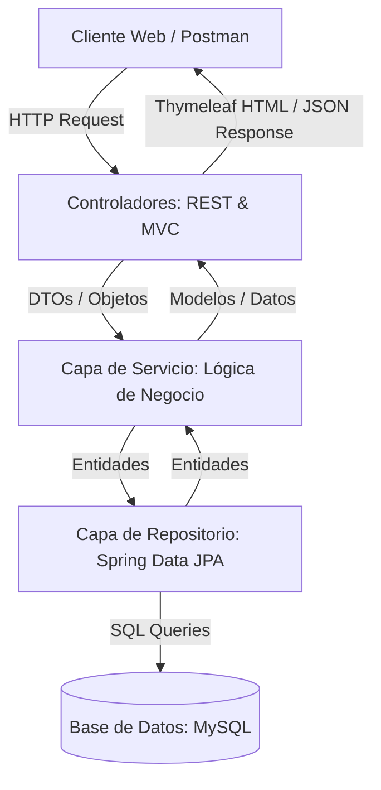

# 🛡️ Sistema de Gestión de Seguros

[](https://openjdk.org/)
[](https://spring.io/projects/spring-boot)
[](https://www.mysql.com/)
[](https://www.thymeleaf.org/)

Este proyecto es una aplicación web y API REST desarrollada con **Spring Boot** para la gestión y administración de pólizas de seguros, clientes, pagos, bienes asegurados y tipos de póliza. Cuenta con una arquitectura en capas, persistencia de datos relacionales en MySQL, vistas dinámicas con Thymeleaf y endpoints REST para la integración con clientes externos.

---

## 📋 Índice
1. [Características Principales](#-características-principales)
2. [Tecnologías Utilizadas](#-tecnologías-utilizadas)
3. [Estructura del Proyecto](#-estructura-del-proyecto)
4. [Arquitectura del Sistema](#-arquitectura-del-sistema)
5. [Requisitos Previos](#%EF%B8%8F-requisitos-previos)
6. [Instalación y Configuración](#%EF%B8%8F-instalación-y-configuración)
7. [Referencia de la API REST](#-referencia-de-la-api-rest)
8. [Vistas Web (Thymeleaf)](#-vistas-web-thymeleaf)
9. [Cómo Subir este Proyecto a GitHub](#-cómo-subir-este-proyecto-a-github)

---

## 🌟 Características Principales

*   **Gestión de Clientes**: Registro, consulta, edición y eliminación de clientes.
*   **Administración de Pólizas**: Creación de pólizas vinculando un cliente, un tipo de póliza y un bien asegurado, con fechas de vigencia automáticas o personalizadas.
*   **Tipos de Pólizas**: Catálogo de tipos de póliza con precios base configurables.
*   **Bienes Asegurados**: Registro detallado de los bienes a asegurar (vehículos, inmuebles, etc.) asociados a un tipo de póliza y vinculados uno a uno con la póliza respectiva.
*   **Control de Pagos**: Registro de transacciones financieras asociadas a pólizas, con soporte para múltiples métodos de pago (Efectivo, Tarjeta, Transferencia) y estados (Pendiente, Pagado, Cancelado).
*   **Automatización**: Interfaz web que calcula y asigna automáticamente el monto del pago a partir del precio base del tipo de póliza seleccionado.
*   **Búsquedas Avanzadas**: Filtros de pólizas por rango de fechas de vencimiento y por cliente.

---

## 🛠️ Tecnologías Utilizadas

*   **Lenguaje**: Java 21
*   **Framework**: Spring Boot 3.5.7
*   **Persistencia (ORM)**: Spring Data JPA + Hibernate
*   **Base de Datos**: MySQL (conector `mysql-connector-j`)
*   **Motor de Plantillas**: Thymeleaf para las vistas web
*   **Estilos y UI**: Bootstrap 5 (a través de CDN)
*   **Utilidades**: Lombok (para reducir código repetitivo)
*   **Herramienta de Construcción**: Maven

---

## 📁 Estructura del Proyecto

La estructura del código sigue el patrón de diseño clásico de una aplicación de tres capas (Controlador, Servicio, Repositorio):

```text
src/main/java/ar/com/proyecto/down/seguros/
├── controller        # Controladores REST y Controladores Web (MVC)
├── dto               # Objetos de Transferencia de Datos (DTO)
├── model             # Entidades de JPA (Mapeo a Base de Datos)
├── repository        # Interfaces de Acceso a Datos (Spring Data JPA)
├── service           # Lógica de Negocio de la aplicación
└── SegurosApplication.java # Clase principal de inicio
```

---

## 🏗️ Arquitectura del Sistema

El siguiente diagrama muestra el flujo de interacción dentro de la aplicación:



---

## ⚙️ Requisitos Previos

Antes de configurar el proyecto, asegúrate de tener instalado:
*   **Java Development Kit (JDK) 21** o superior.
*   **MySQL Server** configurado y corriendo.
*   **Git** (para el control de versiones y subida a GitHub).
*   Un IDE compatible (IntelliJ IDEA, Eclipse, VS Code, NetBeans).

---

## 🛠️ Instalación y Configuración

Sigue estos pasos para levantar la aplicación localmente:

### 1. Clonar el repositorio
```bash
git clone <URL_DE_TU_REPOSITORIO>
cd seguros
```

### 2. Configurar la Base de Datos
Crea una base de datos en MySQL llamada `seguros`. Puedes hacerlo desde tu cliente de MySQL (phpMyAdmin, Workbench, o CLI):
```sql
CREATE DATABASE seguros CHARACTER SET utf8mb4 COLLATE utf8mb4_unicode_ci;
```

### 3. Configurar propiedades de la aplicación
Abre el archivo `src/main/resources/application.properties` y ajusta las credenciales de tu base de datos si es necesario:
```properties
spring.application.name=seguros
spring.jpa.hibernate.ddl-auto=update
spring.datasource.url=jdbc:mysql://localhost:3306/seguros?useSSL=false&serverTimezone=UTC
spring.datasource.username=tu_usuario_mysql  # Por defecto: root
spring.datasource.password=tu_contraseña_mysql # Por defecto vacío o tu clave
spring.jpa.database-platform=org.hibernate.dialect.MySQL8Dialect
spring.jackson.serialization.indent_output=true
```

### 4. Ejecutar la Aplicación
Puedes arrancar el proyecto usando el Maven Wrapper incorporado:
*   **Linux/macOS**:
    ```bash
    ./mvnw spring-boot:run
    ```
*   **Windows**:
    ```cmd
    mvnw.cmd spring-boot:run
    ```

La aplicación estará disponible en: [http://localhost:8080](http://localhost:8080)

---

## 🔌 Referencia de la API REST

A continuación se detallan los endpoints REST del sistema:

### 👥 Clientes (`/clientes`)
| Método | Endpoint | Descripción | Body de entrada (JSON) |
|---|---|---|---|
| **GET** | `/clientes` | Listar todos los clientes | Ninguno |
| **GET** | `/clientes/{id}` | Obtener cliente por ID | Ninguno |
| **POST** | `/clientes/guardar` | Registrar un nuevo cliente | `{"nombre": "Juan Pérez", "email": "juan@example.com"}` |
| **PUT** | `/clientes/editar/{id}` | Modificar datos de un cliente | `{"nombre": "Juan P. Gómez", "email": "juangomez@example.com"}` |
| **DELETE** | `/clientes/eliminar/{id}` | Eliminar un cliente | Ninguno |

### 📄 Pólizas (`/polizas`)
| Método | Endpoint | Descripción | Body de entrada (JSON / DTO) |
|---|---|---|---|
| **GET** | `/polizas/todos` | Listar todas las pólizas | Ninguno |
| **GET** | `/polizas/{id}` | Obtener póliza por ID | Ninguno |
| **POST** | `/polizas/guardar` | Registrar una póliza | `{"numeroPoliza": "POL-123", "fechaInicio": "2026-06-01", "fechaFin": "2027-06-01", "idCliente": 1, "idTipoPoliza": 1, "descripcionBien": "Auto Ford Fiesta", "valorBien": 15000.0}` |
| **GET** | `/polizas/buscarPorVencimiento/{f1}/{f2}`| Buscar pólizas por rango de fin | Ninguno (ej: `/buscarPorVencimiento/2026-01-01/2026-12-31`) |
| **GET** | `/polizas/buscarPorCliente/{id}` | Buscar pólizas de un cliente | Ninguno |
| **PUT** | `/polizas/editar/{id}` | Editar datos de la póliza | DTO de Póliza |
| **DELETE** | `/polizas/eliminar/{id}` | Eliminar póliza | Ninguno |

### 💰 Pagos (`/pagos`)
| Método | Endpoint | Descripción | Body de entrada (JSON / DTO) |
|---|---|---|---|
| **GET** | `/pagos/todos` | Listar todos los pagos | Ninguno |
| **GET** | `/pagos/{id}` | Obtener pago por ID | Ninguno |
| **POST** | `/pagos/guardar` | Registrar un pago | `{"monto": 500.0, "fecha": "2026-06-01", "estado": "PAGADO", "metodoPago": "TARJETA_CREDITO", "idPoliza": 1}` |
| **PUT** | `/pagos/editar/{id}` | Editar monto y método de pago | `{"monto": 600.0, "metodoPago": "TRANSFERENCIA"}` |
| **DELETE** | `/pagos/eliminar/{id}` | Eliminar un pago | Ninguno |

### 🛠️ Otros Endpoints
*   **Tipos de Pólizas** (`/tipopolizas`): endpoints GET, POST (`/guardar`), PUT (`/editar/{id}`), y DELETE (`/eliminar/{id}`) para administrar el catálogo.
*   **Bienes Asegurados** (`/bienes`): endpoints GET (`/todos`, `/{id}`), POST (`/guardar`), PUT (`/editar/{id}`), y DELETE (`/eliminar/{id}`) para controlar los bienes asegurados.

---

## 🖥️ Vistas Web (Thymeleaf)

El sistema incluye una interfaz gráfica minimalista y responsive basada en plantillas de Thymeleaf:

1.  **Gestión de Tipos de Póliza** (`http://localhost:8080/tipos-poliza`):
    *   Formulario para crear nuevos tipos de póliza (Nombre y Precio Base).
    *   Tabla con el listado de todos los tipos creados y sus respectivos precios.
2.  **Gestión de Pagos** (`http://localhost:8080/pagos`):
    *   Formulario de registro de pagos con autocompletado interactivo: al seleccionar una póliza, el campo `Monto` se completa de forma automática con el precio base correspondiente.
    *   Listado general de los pagos realizados en el sistema con visualización de estado, método de pago, póliza y cliente asociado.


